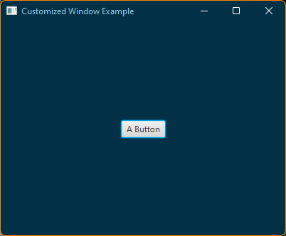
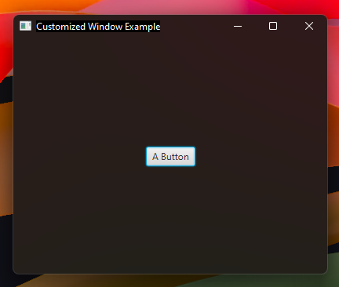

# Customize JavaFX stages on Windows 11

A small collection of utility methods to customize a JavaFX stage. Targets Windows 11+. ```WindowHandle.tryFind``` 
method will throw an HwndLookupException with Error.NOT_SUPPORTED error.

```java
import io.github.mimoguz.customwindow.HwndLookupException;
import io.github.mimoguz.customwindow.WindowHandle;

import javafx.application.Application;
import javafx.application.Platform;
import javafx.geometry.Pos;
import javafx.scene.Scene;
import javafx.scene.control.Button;
import javafx.scene.layout.VBox;
import javafx.scene.paint.Color;
import javafx.stage.Stage;

public class Example extends Application {
    public static void main(final String[] args) {
        launch();
    }

    @Override
    public void start(final Stage stage) {
        final var button = new Button("A Button");

        final var root = new VBox();
        root.setAlignment(Pos.CENTER);
        root.getChildren().add(button);
        root.setStyle("-fx-background-color: rgb(2, 48, 71);");

        final var scene = new Scene(root, 400, 300);
        stage.setScene(scene);

        stage.setTitle("Customized Window Example");

        Platform.runLater(() -> {
            try {
                WindowHandle.tryFind(stage)
                        .withCaptionColor(Color.rgb(2, 48, 71))
                        .withTextColor(Color.rgb(142, 202, 230))
                        .withBorderColor(Color.rgb(251, 133, 0));
            } catch (HwndLookupException e) {
                switch (e.getError()) {
                    case NOT_SUPPORTED:
                        // Current platform is not supported.
                        break;
                    case NOT_FOUND:
                        // Couldn't find the window.
                        break;
                    case BOUND:
                        // The library uses a naive, title text based search.
                        // If 'titleProperty' of the stage is bound, this method will fail. 
                        break;
                }
            }
        });

        stage.show();
    }
}
```



## Newer Alternatives

* [fx-jni](https://github.com/xdsswar/shared-fx-jni-src)
* [FXThemes](https://github.com/dukke/FXThemes)

## The Mica Material

You can apply the mica material to your stage like this:

```java
import io.github.mimoguz.customwindow.HwndLookupException;
import io.github.mimoguz.customwindow.WindowHandle;

import javafx.application.Application;
import javafx.application.Platform;
import javafx.geometry.Pos;
import javafx.scene.Scene;
import javafx.scene.control.Button;
import javafx.scene.layout.VBox;
import javafx.scene.paint.Color;
import javafx.stage.Stage;

public class Example extends Application {
    public static void main(final String[] args) {
        launch();
    }

    @Override
    public void start(final Stage stage) {
        final var button = new Button("A Button");

        final var root = new VBox();
        root.setAlignment(Pos.CENTER);
        root.getChildren().add(button);
        root.setStyle("-fx-background-color: transparent");

        final var scene = new Scene(root, 400, 300);
        scene.setFill(Color.TRANSPARENT);
        stage.setScene(scene);

        stage.initStyle(StageStyle.UNIFIED);
        stage.setTitle("Customized Window Example");

        Platform.runLater(() -> {
            try {
                final var handle = WindowHandle.tryFind(stage);
                // Optionally enable the dark mode:
                handle.dwmSetBooleanValue(DwmAttribute.DWMWA_USE_IMMERSIVE_DARK_MODE, true);
                // Enable the mica material
                // DWMWA_SYSTEMBACKDROP_TYPE method is the newer way:
                if (!handle.dwmSetIntValue(
                        DwmAttribute.DWMWA_SYSTEMBACKDROP_TYPE,
                        // There is also DWMSBT_TABBEDWINDOW option, which gives a more translucent look.
                        DwmAttribute.DWMSBT_MAINWINDOW.value
                )) {
                    // This is the "old" way:
                    handle.dwmSetBooleanValue(DwmAttribute.DWMWA_MICA_EFFECT, true);
                }
            } catch (HwndLookupException e) {
                // Ignore
            }
        });

        stage.show();
    }
}
```



<del>If you look closely at the screenshot, you will see that the title text background is still opaque. 
From what I gathered so far, to fix this we need to add WS_EX_NOREDIRECTIONBITMAP to extended window styles 
(and maybe a couple other sytles, but that's the problematic one). That, apparently, cannot be done after the window 
was created. So I think a JavaFX level fix (in GlassWindow.cpp) is needed here.</del>

Windows 11 22H2 update solved the opaque title text background issuse. But, to make the mica effect work reliably, 
you will -most probably- need to set ```prism.forceUploadingPainter``` JVM option to ```true``` 
([the related issue](https://github.com/mimoguz/custom_window/issues/2)). 
For Maven, you can add this option to JavaFX plugin configuration in your ```pom.xml```, like this:

```xml
<plugin>
    <groupId>org.openjfx</groupId>
    <artifactId>javafx-maven-plugin</artifactId>
    <version>0.0.8</version>
    <configuration>
        <mainClass>Example</mainClass>
        <options>
          <option>-Dprism.forceUploadingPainter=true</option>
        </options>
    </configuration>
</plugin>
```

This unfortunately may have adverse effects on performance, Eroica (the one who did/does all the hard work) found out. 
If you're interested in using the mica effect in your JavaFX app, you might want to read their posts in the linked issue.


